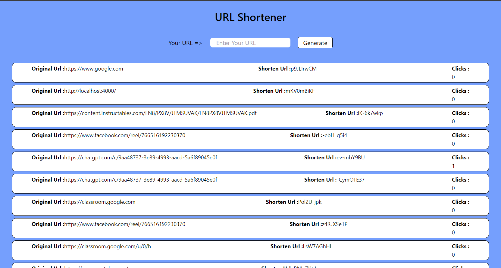

# URL-Shortener
Done this task to learn about Mongo and Express during my Internship at Bytewise

## Tools and Language Used
- MongoDB
- Express
- EJS (Embedded JavaScript templates)

## Working Steps
1. Enter your URL
2. Click the Generate Button to Create Shorten URL
3. use the Generated URL like http://localhost:4000/(Shorten-URL)

## Point to Ponder
- MongoDB: NoSQL database storing data in JSON-like documents.
- MongoDB Compass: GUI for exploring and managing MongoDB data.
- MongoDB Atlas: Cloud-based, fully managed MongoDB service.
- Mongoose: ODM library for MongoDB in Node.js.
- MongoDB Shell (mongosh): Command-line interface for MongoDB.3
- Make sure to use Middlewares for proper connections while working on server
- <%= text %>: Outputs the value of the expression. Used to render data from your server.
- <% text %>: Executes JavaScript code. It is used for as loops and conditionals.